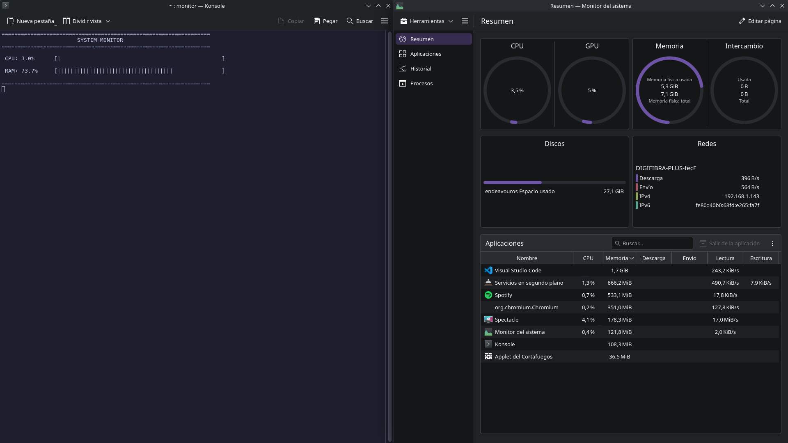

# SysMon-CPP: Lightweight Linux System Monitor ⚙️

A lightweight, Object-Oriented system resource monitor for Linux environments, written entirely in modern C++.

This project demonstrates low-level system interaction by parsing kernel data directly from the `/proc` virtual filesystem, built with a clean, modular architecture suitable for performance-critical environments.

**🔗 Part of the SysMon Architecture:** This repository is the agent component. It works in tandem with the [SysMon Server](https://github.com/rafaafdeez/sysmon-server) (a Java backend that receives and processes the telemetry over TCP).



## Features

- **Real-Time Telemetry:** Calculates precise CPU load (delta between clock ticks) and RAM utilization.
- **Distributed Networking:** Transmits live system metrics formatted as JSON over TCP sockets to a decoupled backend.
- **Zero Dependencies:** Relies purely on the Linux standard library, POSIX sockets, and `/proc` pseudo-files (`/proc/stat`, `/proc/meminfo`).
- **OOP Architecture:** Separation of concerns using a simplified Model-View-Controller (MVC) approach.
- **CLI UI:** Custom ASCII progress bars and terminal ANSI escape codes for a flicker-free dashboard experience.

## Tech Stack

- **Language:** C++17
- **Build System:** CMake
- **Networking:** POSIX Sockets (TCP)
- **Target OS:** Linux (Arch / EndeavourOS tested)

## Architecture

The codebase is strictly separated into focused classes following the Single Responsibility Principle (SRP):

- `Parser`: The data extraction layer. Handles file I/O operations and safely parses raw system jiffies and memory blocks.
- `SystemInfo`: The state management layer. Stores historical data to calculate deltas and utilization percentages.
- `Display`: The presentation layer. Renders the data into visual terminal elements.
- `NetworkClient`: The network connection layer. Dynamically manages TCP sockets and formats the core telemetry into JSON payloads.

## Build and Installation

To compile the project from source, ensure you have `cmake` and a C++ compiler (`gcc`/`g++`) installed.

```bash
# 1. Clone the repository
git clone [https://github.com/rafaafdeez/SysMon-CPP.git](https://github.com/rafaafdeez/SysMon-CPP.git)
cd SysMon-CPP

# 2. Create the build directory
mkdir build && cd build

# 3. Configure and compile
cmake ..
make

# 4. (Optional) Install globally to use via terminal or application launcher
sudo make install
```
